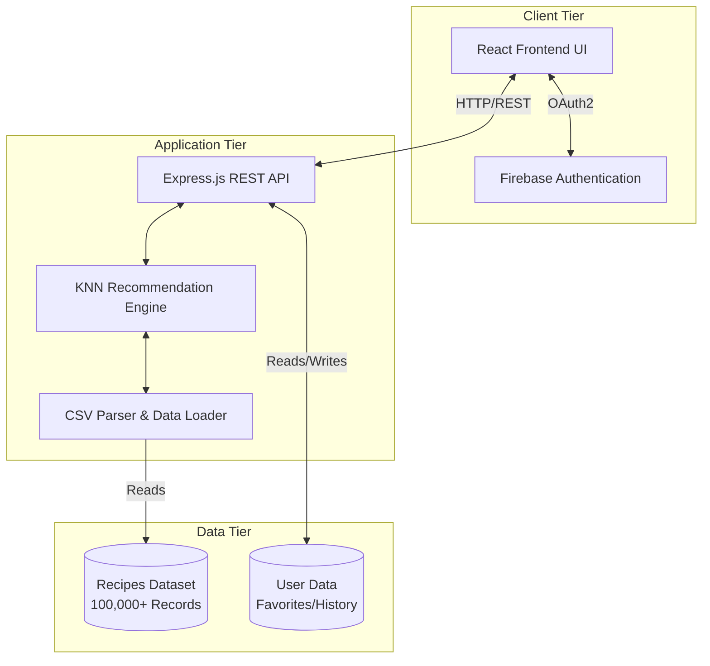
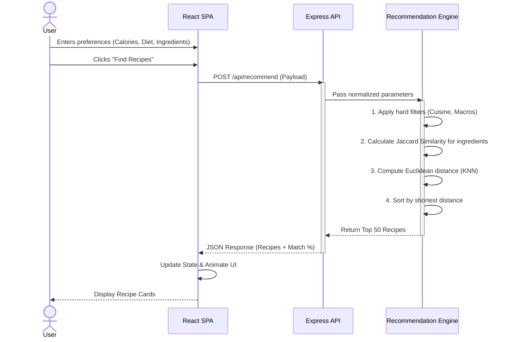

# 🍳 Smart Recipe Recommender

An intelligent, full-stack culinary assistant that leverages machine learning algorithms to provide highly personalized recipe recommendations based on nutritional goals, dietary preferences, and available ingredients.

---

## 📋 Table of Contents
- [Problem Statement](#-problem-statement)
- [The Solution](#-the-solution)
- [Methodology & Algorithm](#-methodology--algorithm)
- [Key Features & How They Work](#-key-features--how-they-work)
- [System Architecture](#-system-architecture)
- [Application Workflow](#-application-workflow)
- [Tech Stack](#-tech-stack)
- [Getting Started](#-getting-started)

---

## 🎯 Problem Statement
In today's fast-paced world, individuals often struggle to find meals that align with their specific health goals, dietary restrictions, and the ingredients they already have in their pantry. Generic recipe websites provide overwhelming search results based purely on keywords, ignoring the complex, multi-dimensional needs of a user (e.g., hitting a specific calorie target, maximizing protein, and utilizing leftover spinach and chicken). This leads to food waste, diet abandonment, and decision fatigue.

## 💡 The Solution
The **Smart Recipe Recommender** solves this by shifting from keyword-based search to a **mathematical recommendation engine**. By treating recipes and user preferences as vectors in a multi-dimensional space, the application calculates the exact "distance" between what a user wants and the 100,000+ recipes in the database, surfacing the mathematically optimal meals for their specific context.

## 🔬 Methodology & Algorithm
The core of the application relies on a custom implementation of the **K-Nearest Neighbors (KNN)** algorithm combined with **Jaccard Similarity**.

1. **Hard Constraints Filtering:** The dataset is first rapidly filtered using strict boolean constraints (e.g., Cuisine Type, High Protein, Low Carb).
2. **Data Normalization:** Continuous variables like Calories are normalized to a `[0, 1]` scale to ensure they don't disproportionately skew the distance calculation.
3. **Jaccard Similarity (Ingredients):** User ingredients and recipe ingredients are tokenized, stemmed, and converted to mathematical Sets. The Jaccard Index (Intersection over Union) is calculated to find the ingredient match percentage.
4. **Euclidean Distance Calculation:** The system calculates the multi-dimensional distance using:
   - Calorie variance
   - Diet type variance
   - Ingredient similarity score (weighted heavily)
   - Rating bonus (highly-rated recipes get a slight distance reduction)
5. **Sorting & Delivery:** The top 50 recipes with the shortest mathematical distance to the user's query are returned.

---

## ✨ Key Features & How They Work

### 1. AI-Powered Recommendation Engine
* **How it works:** Users input their target calories, diet type (Veg/Non-Veg), and available ingredients. The backend processes this through the KNN algorithm and returns recipes ranked by match accuracy.

### 2. Advanced Macro-Nutrient Filtering
* **How it works:** Users can toggle specific health goals (Low Calorie, High Protein, Low Fat, Low Carb, High Fiber). The backend applies these as strict threshold filters before running the recommendation algorithm.

### 3. Guided "Cook This Now" Mode
* **How it works:** When viewing a recipe, users can enter a focus mode. The UI isolates the current cooking step, highlighting it and providing "Next Step" navigation, keeping the user's place while they cook.

### 4. Smart Ingredient Matching
* **How it works:** The system uses NLP stemming (e.g., treating "tomatoes" and "tomato" as the same) and Set theory to accurately calculate what percentage of a recipe a user can cook with their current pantry.

### 5. Favorites & Search History
* **How it works:** Authenticated users can save recipes to their favorites. The system also logs previous searches, allowing users to quickly re-run complex queries with a single click.

---

## 🏗️ System Architecture

The application follows a modern Client-Server architecture, utilizing a React Single Page Application (SPA) communicating with an Express.js Node backend via RESTful APIs.



---

## 🔄 Application Workflow

The following sequence diagram illustrates the core recommendation workflow from user input to result rendering.



---

## 💻 Tech Stack

### Frontend
* **Framework:** React 18 with TypeScript
* **Build Tool:** Vite
* **Styling:** Tailwind CSS
* **UI Components:** shadcn/ui (Radix UI primitives)
* **Animations:** Framer Motion
* **Icons:** Lucide React

### Backend
* **Runtime:** Node.js
* **Framework:** Express.js
* **Data Processing:** `csv-parse` for high-performance dataset loading
* **Architecture:** RESTful API

### Infrastructure & Services
* **Authentication:** Firebase Auth (Google OAuth)
* **Image Delivery:** LoremFlickr API (Deterministic image generation)
* **Deployment:** Google Cloud Run (via AI Studio)

---

## 🚀 Getting Started

### Prerequisites
- Node.js (v18 or higher)
- npm or yarn

### Installation

1. Clone the repository and install dependencies:
   ```bash
   npm install
   ```

2. Generate the recipe dataset (creates 100,000 recipes):
   ```bash
   npx tsx generate_data.ts
   ```

3. Set up environment variables:
   Create a `.env` file based on `.env.example` and add your Firebase/Gemini keys if applicable.

4. Start the development server:
   ```bash
   npm run dev
   ```

5. Build for production:
   ```bash
   npm run build
   npm start
   ```

## 👨‍💻 Developed By
**MOHAN SRIRAM**

---

## 📈 Future Roadmap
- [ ] **Image Generation**: Use Gemini/DALL-E to generate custom visuals for user-submitted recipes.
- [ ] **Voice Control**: Hands-free cooking mode for the instructions page.
- [ ] **Grocery Integration**: Export ingredients directly to shopping list apps.
